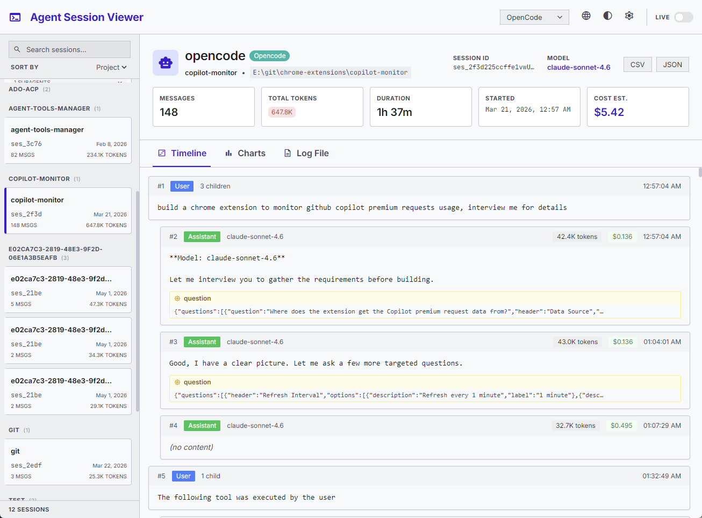

# Agent Session Viewer

**English** | [中文](./README.zh.md)

A web application for analyzing and visualizing **Claude Code**, **Copilot CLI**, **Codex**, **OpenCode**, and **VS Code Copilot Chat** sessions. It provides a structured view of your AI agent interactions, making it easier to debug, understand costs, and review the context of your coding sessions.



## Features

-   **Multi-Agent Support**: View and analyze sessions from Claude Code, Copilot CLI, Codex, OpenCode, and VS Code Copilot Chat in a single interface.
-   **Subagent Drill-down**: Sessions that launched subagents (via the `task`/`Agent` tool) show an expandable subagent list in the sidebar. Click any subagent to open a full-page view with **four tabs** (Timeline, Tree, Charts, Raw) — the same as the parent session view.
-   **Token Usage & Cost**: Displays input/output/cache token counts per message and cumulative totals, plus USD cost per message and per session. All sources report exact token counts (Copilot CLI from its `session.shutdown` summary; VS Code from its debug logs). Cost is always computed from the built-in pricing table.
-   **Conversation Timeline**: Clean timeline of the full conversation with tool call summaries grouped by name.
-   **Charts View**: Visual breakdown of token usage over the session — input, output, and cache trends.
-   **Tool Call Tracking**: Summarizes tool usage frequency and success rates per session.
-   **Live Updates Toggle**: Real-time file watching is available but **off by default**. Enable it with the Live/Offline toggle in the header, or set `WATCH_ENABLED=true` to start it automatically.
-   **Session Export**: Export sessions to JSON or Markdown for sharing or archiving.
-   **WebSocket Integration**: Efficient real-time communication between the server and client.

## Quick Start

You can run the Agent Session Viewer directly without installing it globally using `npx`:

```bash
npx @cuteribs/agent-session-viewer
```

This will:
1.  Start the local server.
2.  Automatically open the web interface in your default browser.
3.  Begin reading your Claude, Copilot, Codex, OpenCode, and VS Code session directories.

### Configuration

By default, the tool looks for sessions in:
-   Claude: `~/.claude/projects`
-   Copilot: `~/.copilot/session-state`
-   Codex: `~/.codex/sessions`
-   OpenCode: `~/.local/share/opencode/storage` (file mode) or `~/.local/share/opencode/opencode.db` (SQLite DB mode, auto-detected)
-   VS Code: `~/AppData/Roaming/Code/User` (Windows; scans `workspaceStorage/*/chatSessions` and `globalStorage/emptyWindowChatSessions`)

You can override these paths or the port using environment variables. Copy `.env.example` to `.env` and adjust as needed:

| Variable | Default | Description |
|---|---|---|
| `PORT` | `3000` | HTTP server port |
| `HOST` | `localhost` | HTTP server host |
| `CLAUDE_PATHS` | `~/.claude/projects` | Comma-separated Claude session directories |
| `COPILOT_PATHS` | `~/.copilot/session-state` | Comma-separated Copilot session directories |
| `CODEX_PATHS` | `~/.codex/sessions` | Comma-separated Codex session directories |
| `OPENCODE_PATHS` | `~/.local/share/opencode/storage` | Comma-separated OpenCode session directories |
| `VSCODE_PATHS` | `~/AppData/Roaming/Code/User` | Comma-separated VS Code user-data directories |
| `WATCH_ENABLED` | `false` | Set to `true` to enable live file watching on startup |
| `WATCH_DEBOUNCE_MS` | `500` | Debounce interval (ms) for file-watch change events |

## Supported Session Formats

### Claude Code
Sessions are stored as `.jsonl` files under `~/.claude/projects/{encoded-project-path}/`. Each line is a JSON event containing messages, tool calls, and token usage (exact values from the Claude API).

Subagents launched via the `Agent` tool are stored in a `subagents/` subdirectory alongside each session file (`{session-id}/subagents/agent-*.jsonl`). The viewer automatically loads and displays these with full token breakdowns.

### Copilot CLI
Sessions are stored as `events.jsonl` under `~/.copilot/session-state/{session-id}/`. Events include user messages, assistant responses (`assistant.message`), tool executions, hook events, and subagent lifecycle events.

Token counts for Copilot are **exact**. Completed sessions end with a `session.shutdown` event whose `modelMetrics` carry the authoritative per-model token usage (input, output, cache read/write, reasoning) and request counts — these are used as the session totals. For sessions that have not yet shut down, the viewer falls back to summing the per-message `outputTokens` from `assistant.message` events (input is reported as 0 until a shutdown summary is available).

Subagents launched via the `task` tool report aggregate stats (total tokens, tool call count, model, duration) from `subagent.completed` events, and their individual turns are routed into a per-subagent message log.

### Codex
Sessions are stored as `.jsonl` files under `~/.codex/sessions/{year}/{month}/{day}/`. The format includes `session_meta` (metadata), `event_msg` (user and agent messages, token counts, task lifecycle), `response_item` (tool calls and outputs), and `turn_context` (model and configuration). Token usage is extracted from `token_count` events.

### OpenCode
Sessions are stored in two formats, auto-detected by the viewer:

- **SQLite DB** (default, current): `~/.local/share/opencode/opencode.db` — the viewer reads session, message, and part tables directly. This is the primary mode for recent OpenCode versions.
- **JSON files** (legacy): `~/.local/share/opencode/storage/` — session metadata in `session/<project>/<id>.json`, per-message JSON in `message/<session_id>/`, and parts in `part/<message_id>/`.

Token usage and cost data are extracted per-message for exact input/output/cache breakdowns. Cost is always recalculated from the pricing table (the DB stores `cost=0`).

**Subagents:** OpenCode child sessions (`parent_id IS NOT NULL` in the DB) are treated as subagents of their parent session. They appear in the sidebar expand list and open as full subagent views with four tabs (Timeline, Tree, Charts, Raw). The parent session timeline includes synthetic summary entries showing each subagent's effective token usage and cost.

### VS Code (Copilot Chat)
Sessions are stored as JSON state logs under the VS Code user-data directory:

- **Workspace sessions:** `workspaceStorage/<hash>/chatSessions/*.json`
- **Empty-window sessions:** `globalStorage/emptyWindowChatSessions/*.json`

The project path is resolved from the `folder` recorded in the workspace's `workspace.json` (the real project directory, not the storage hash); Empty Window sessions fall back to the storage entry directory.

Exact token counts come from the Copilot Chat **debug logs** at `workspaceStorage/<hash>/GitHub.copilot-chat/debug-logs/<sessionId>/` — `main.jsonl` for the main session and `runSubagent-default-call_<toolCallId>.jsonl` for each subagent. Each tool call's input arguments and result are also recovered from these spans (matched to the session log by tool name), so both are shown in the content preview.

## Development

If you want to contribute or run the project from source:

### Prerequisites

-   Node.js (v20 or higher)
-   npm

### Setup

1.  **Clone the repository:**
    ```bash
    git clone <repository-url>
    cd agent-session-viewer
    ```

2.  **Install dependencies** (install each package separately — there is no root workspace):
    ```bash
    cd packages/shared && npm install
    cd ../server && npm install
    cd ../client && npm install
    ```

3.  **Build the shared library** (required before running server or client):
    ```bash
    cd packages/shared && npm run build
    ```

4.  **Run in development mode:**
    ```bash
    # Server (from packages/server)
    npm run dev

    # Client (from packages/client, in a separate terminal)
    npm run dev
    ```

5.  **Build for production:**
    ```bash
    # Build client first
    cd packages/client && npm run build

    # Build server and copy client assets
    cd packages/server && npm run build && npm run build:public
    ```

## Token Pricing Reference

> Source: [GitHub Copilot – Models and Pricing](https://docs.github.com/en/copilot/reference/copilot-billing/models-and-pricing)  
> All prices are **per 1 million tokens**. 1 AI credit = $0.01 USD.

### OpenAI

| Model | Category | Input | Cached Input | Output |
|---|---|---|---|---|
| GPT-4.1 ¹ | Versatile | $2.00 | $0.50 | $8.00 |
| GPT-5 mini ¹ | Lightweight | $0.25 | $0.025 | $2.00 |
| GPT-5.2 | Versatile | $1.75 | $0.175 | $14.00 |
| GPT-5.2-Codex | Powerful | $1.75 | $0.175 | $14.00 |
| GPT-5.3-Codex | Powerful | $1.75 | $0.175 | $14.00 |
| GPT-5.4 ² | Versatile | $2.50 | $0.25 | $15.00 |
| GPT-5.4 mini | Lightweight | $0.75 | $0.075 | $4.50 |
| GPT-5.4 nano | Lightweight | $0.20 | $0.02 | $1.25 |
| GPT-5.5 | Powerful | $5.00 | $0.50 | $30.00 |

### Anthropic

Anthropic models include an additional **cache write** cost.

| Model | Category | Input | Cached Input | Cache Write | Output |
|---|---|---|---|---|---|
| Claude Haiku 4.5 | Versatile | $1.00 | $0.10 | $1.25 | $5.00 |
| Claude Sonnet 4 | Versatile | $3.00 | $0.30 | $3.75 | $15.00 |
| Claude Sonnet 4.5 | Versatile | $3.00 | $0.30 | $3.75 | $15.00 |
| Claude Sonnet 4.6 | Versatile | $3.00 | $0.30 | $3.75 | $15.00 |
| Claude Opus 4.5 | Powerful | $5.00 | $0.50 | $6.25 | $25.00 |
| Claude Opus 4.6 | Powerful | $5.00 | $0.50 | $6.25 | $25.00 |
| Claude Opus 4.7 | Powerful | $5.00 | $0.50 | $6.25 | $25.00 |
| Claude Opus 4.8 | Powerful | $5.00 | $0.50 | $6.25 | $25.00 |

### Google

| Model | Category | Input | Cached Input | Output |
|---|---|---|---|---|
| Gemini 2.5 Pro ³ | Powerful | $1.25 | $0.125 | $10.00 |
| Gemini 3 Flash | Lightweight | $0.50 | $0.05 | $3.00 |
| Gemini 3.1 Pro ³ | Powerful | $2.00 | $0.20 | $12.00 |

### xAI

| Model | Category | Input | Cached Input | Output |
|---|---|---|---|---|
| Grok Code Fast 1 | Lightweight | $0.20 | $0.02 | $1.50 |

> ¹ GPT-4.1 and GPT-5 mini are included models (no extra credit charge on paid plans).  
> ² GPT-5.4 pricing applies to prompts with ≤272K tokens.  
> ³ Gemini 2.5 Pro and Gemini 3.1 Pro pricing applies to prompts with ≤200K tokens.
