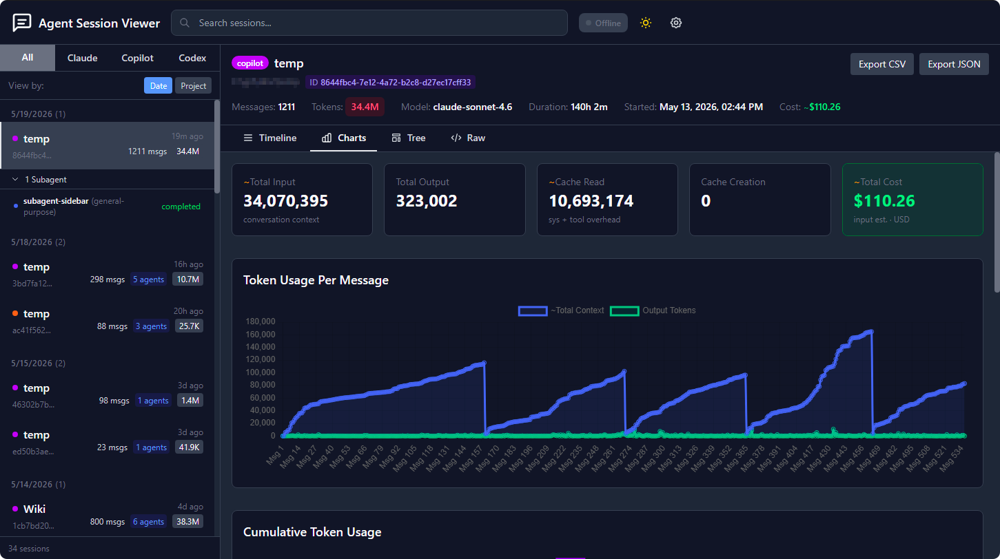

# Agent Session Viewer

[English](./README.md) | **中文**

一个用于分析和可视化 **Claude Code**、**Copilot CLI** 和 **Codex** 会话的 Web 应用。它提供了对 AI 代理交互过程的结构化展示，帮助你调试问题、分析成本，并回顾编码会话的上下文。



## 功能特性

-   **多 Agent 支持**：在同一界面中查看和分析来自 Claude Code、Copilot CLI 和 Codex 的会话。
-   **子 Agent 展开查看**：对于通过 `task`/`Agent` 工具启动了子 Agent 的会话，侧边栏会显示可展开的子 Agent 列表。点击任意子 Agent 可进入全页视图，展示其提示词、执行结果、Token 统计和工具调用次数。
-   **Token 用量与成本**：按消息和累计显示输入/输出/缓存 Token 数量，以及每条消息和整个会话的预估 USD 成本。Claude Code 和 Codex 使用精确 Token 数；Copilot 会话使用校准后的估算模型。
-   **会话时间线**：以清晰的时间线展示完整对话历史，工具调用按名称分组汇总。
-   **图表视图**：可视化展示会话中输入、输出和缓存 Token 的变化趋势。
-   **工具调用统计**：汇总每个会话的工具使用频率和成功率。
-   **实时更新开关**：文件监听功能**默认关闭**。可通过页面顶部的 Live/Offline 开关启用，或设置 `WATCH_ENABLED=true` 环境变量在启动时自动开启。
-   **会话导出**：支持将会话导出为 JSON 或 Markdown 格式，便于分享或存档。
-   **WebSocket 集成**：服务端与客户端之间使用 WebSocket 进行高效的实时通信。

## 快速开始

无需全局安装，直接使用 `npx` 运行：

```bash
npx @cuteribs/agent-session-viewer
```

这将会：
1.  启动本地服务器。
2.  自动在默认浏览器中打开 Web 界面。
3.  读取默认的 Claude、Copilot 和 Codex 会话目录。

### 配置

默认情况下，工具会在以下路径查找会话文件：
-   Claude：`~/.claude/projects`
-   Copilot：`~/.copilot/session-state`
-   Codex：`~/.codex/sessions`

可通过环境变量覆盖上述路径或端口号。将 `.env.example` 复制为 `.env` 并按需修改：

| 变量名 | 默认值 | 说明 |
|---|---|---|
| `PORT` | `3000` | HTTP 服务器端口 |
| `CLAUDE_PATHS` | `~/.claude/projects` | Claude 会话目录，多个路径用逗号分隔 |
| `COPILOT_PATHS` | `~/.copilot/session-state` | Copilot 会话目录，多个路径用逗号分隔 |
| `CODEX_PATHS` | `~/.codex/sessions` | Codex 会话目录，多个路径用逗号分隔 |
| `WATCH_ENABLED` | `false` | 设为 `true` 可在启动时开启实时文件监听 |

## 支持的会话格式

### Claude Code
会话以 `.jsonl` 文件形式存储在 `~/.claude/projects/{encoded-project-path}/` 下。每行为一个 JSON 事件，包含消息、工具调用和 Token 用量（来自 Claude API 的精确数值）。

通过 `Agent` 工具启动的子 Agent 会存储在每个会话文件同级的 `subagents/` 子目录中（路径为 `{session-id}/subagents/agent-*.jsonl`）。查看器会自动加载并展示这些文件，包含完整的 Token 用量明细。

### Copilot CLI
会话以 `events.jsonl` 文件形式存储在 `~/.copilot/session-state/{session-id}/` 下。事件包括用户消息、助手回复、工具执行、上下文压缩（compaction）事件以及子 Agent 生命周期事件。

Copilot 的 Token 数量为**估算值**（会话日志中不包含精确的 API Token 数）。估算器使用经过校准的字符/Token 比率，并以 `session.compaction_start` 中的实际数据进行交叉验证。估算值会用 `~` 标注。

通过 `task` 工具启动的子 Agent 会从 `subagent.completed` 事件中报告汇总统计数据（总 Token 数、工具调用次数、模型名称、耗时）。

### Codex
会话以 `.jsonl` 文件形式存储在 `~/.codex/sessions/{year}/{month}/{day}/` 下。格式包括：`session_meta`（元数据）、`event_msg`（用户和 Agent 消息、Token 统计、任务生命周期）、`response_item`（工具调用及输出）以及 `turn_context`（模型和配置信息）。Token 用量从 `token_count` 事件中提取。

## 开发指南

如需贡献代码或从源码运行项目：

### 环境要求

-   Node.js（v20 或更高版本）
-   npm

### 初始化

1.  **克隆仓库：**
    ```bash
    git clone <repository-url>
    cd agent-session-viewer
    ```

2.  **安装依赖**（各包需单独安装——项目未使用根工作区）：
    ```bash
    cd packages/shared && npm install
    cd ../server && npm install
    cd ../client && npm install
    ```

3.  **构建共享库**（运行服务端或客户端之前必须先执行此步骤）：
    ```bash
    cd packages/shared && npm run build
    ```

4.  **开发模式运行：**
    ```bash
    # 服务端（在 packages/server 目录下）
    npm run dev

    # 客户端（在 packages/client 目录下，另开一个终端）
    npm run dev
    ```

5.  **生产环境构建：**
    ```bash
    # 先构建客户端
    cd packages/client && npm run build

    # 构建服务端并复制客户端资源
    cd packages/server && npm run build && npm run build:public
    ```


## Token 计价参考

> 来源：[GitHub Copilot – 模型与定价](https://docs.github.com/en/copilot/reference/copilot-billing/models-and-pricing)  
> 所有价格均为**每百万 Token**。1 AI 积分 = $0.01 美元。

### OpenAI

| 模型 | 类别 | 输入 | 缓存输入 | 输出 |
|---|---|---|---|---|
| GPT-4.1 ¹ | 通用 | $2.00 | $0.50 | $8.00 |
| GPT-5 mini ¹ | 轻量 | $0.25 | $0.025 | $2.00 |
| GPT-5.2 | 通用 | $1.75 | $0.175 | $14.00 |
| GPT-5.2-Codex | 强力 | $1.75 | $0.175 | $14.00 |
| GPT-5.3-Codex | 强力 | $1.75 | $0.175 | $14.00 |
| GPT-5.4 ² | 通用 | $2.50 | $0.25 | $15.00 |
| GPT-5.4 mini | 轻量 | $0.75 | $0.075 | $4.50 |
| GPT-5.4 nano | 轻量 | $0.20 | $0.02 | $1.25 |
| GPT-5.5 | 强力 | $5.00 | $0.50 | $30.00 |

### Anthropic

Anthropic 模型除缓存输入外还包含额外的**缓存写入**费用。

| 模型 | 类别 | 输入 | 缓存输入 | 缓存写入 | 输出 |
|---|---|---|---|---|---|
| Claude Haiku 4.5 | 通用 | $1.00 | $0.10 | $1.25 | $5.00 |
| Claude Sonnet 4 | 通用 | $3.00 | $0.30 | $3.75 | $15.00 |
| Claude Sonnet 4.5 | 通用 | $3.00 | $0.30 | $3.75 | $15.00 |
| Claude Sonnet 4.6 | 通用 | $3.00 | $0.30 | $3.75 | $15.00 |
| Claude Opus 4.5 | 强力 | $5.00 | $0.50 | $6.25 | $25.00 |
| Claude Opus 4.6 | 强力 | $5.00 | $0.50 | $6.25 | $25.00 |
| Claude Opus 4.7 | 强力 | $5.00 | $0.50 | $6.25 | $25.00 |

### Google

| 模型 | 类别 | 输入 | 缓存输入 | 输出 |
|---|---|---|---|---|
| Gemini 2.5 Pro ³ | 强力 | $1.25 | $0.125 | $10.00 |
| Gemini 3 Flash | 轻量 | $0.50 | $0.05 | $3.00 |
| Gemini 3.1 Pro ³ | 强力 | $2.00 | $0.20 | $12.00 |

### 微调模型（GitHub）

| 模型 | 类别 | 输入 | 缓存输入 | 输出 |
|---|---|---|---|---|
| Raptor mini | 通用 | $0.25 | $0.025 | $2.00 |
| Goldeneye | 强力 | $1.25 | $0.125 | $10.00 |

> ¹ GPT-4.1 和 GPT-5 mini 为内含模型（付费套餐不额外扣除积分）。  
> ² GPT-5.4 定价适用于 ≤272K Token 的提示。  
> ³ Gemini 2.5 Pro 和 Gemini 3.1 Pro 定价适用于 ≤200K Token 的提示。
