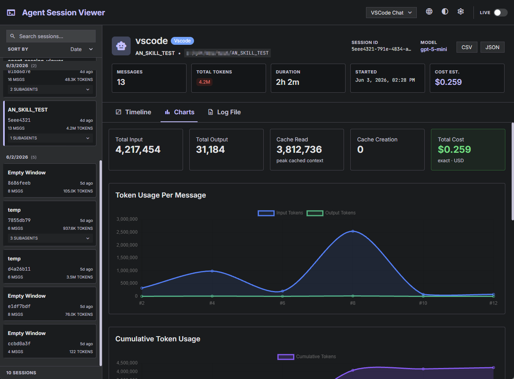

# Agent Session Viewer

[English](./README.md) | **中文**

一个用于分析和可视化 **Claude Code**、**Copilot CLI**、**Codex**、**OpenCode** 和 **VS Code Copilot Chat** 会话的 Web 应用。它提供了对 AI 代理交互过程的结构化展示，帮助你调试问题、分析成本，并回顾编码会话的上下文。



## 功能特性

-   **多 Agent 支持**：在同一界面中查看和分析来自 Claude Code、Copilot CLI、Codex、OpenCode 和 VS Code Copilot Chat 的会话。
-   **子 Agent 展开查看**：对于通过 `task`/`Agent` 工具启动了子 Agent 的会话，侧边栏会显示可展开的子 Agent 列表。点击任意子 Agent 可进入全页视图，包含与父会话相同的**四个标签页**（时间线、树形图、图表、原始数据）。
-   **Token 用量与成本**：按消息和累计显示输入/输出/缓存 Token 数量，以及每条消息和整个会话的 USD 成本。所有来源均报告精确 Token 数（Copilot CLI 来自其 `session.shutdown` 汇总；VS Code 来自其调试日志）。成本始终根据内置定价表计算。
-   **会话时间线**：以清晰的时间线展示完整对话历史，工具调用按名称分组汇总。
-   **图表视图**：可视化展示会话中输入、输出和缓存 Token 的变化趋势。
-   **工具调用统计**：汇总每个会话的工具使用频率和成功率。
-   **实时更新开关**：文件监听功能**默认关闭**。可通过页面顶部的 Live/Offline 开关启用，或设置 `WATCH_ENABLED=true` 环境变量在启动时自动开启。
-   **会话导出**：支持将会话导出为 JSON 或 Markdown 格式，便于分享或存档。
-   **WebSocket 集成**：服务端与客户端之间使用 WebSocket 进行高效的实时通信。

## 快速开始

无需全局安装，直接使用 `npx` 运行：

```bash
npx @cuteribs/agent-session-viewer
```

这将会：
1.  启动本地服务器。
2.  自动在默认浏览器中打开 Web 界面。
3.  读取默认的 Claude、Copilot、Codex、OpenCode 和 VS Code 会话目录。

### 配置

默认情况下，工具会在以下路径查找会话文件：
-   Claude：`~/.claude/projects`
-   Copilot：`~/.copilot/session-state`
-   Codex：`~/.codex/sessions`
-   OpenCode：`~/.local/share/opencode/storage`（文件模式）或 `~/.local/share/opencode/opencode.db`（SQLite DB 模式，自动检测）
-   VS Code：`~/AppData/Roaming/Code/User`（Windows；扫描 `workspaceStorage/*/chatSessions` 与 `globalStorage/emptyWindowChatSessions`）

可通过环境变量覆盖上述路径或端口号。将 `.env.example` 复制为 `.env` 并按需修改：

| 变量名 | 默认值 | 说明 |
|---|---|---|
| `PORT` | `3000` | HTTP 服务器端口 |
| `HOST` | `localhost` | HTTP 服务器主机 |
| `CLAUDE_PATHS` | `~/.claude/projects` | Claude 会话目录，多个路径用逗号分隔 |
| `COPILOT_PATHS` | `~/.copilot/session-state` | Copilot 会话目录，多个路径用逗号分隔 |
| `CODEX_PATHS` | `~/.codex/sessions` | Codex 会话目录，多个路径用逗号分隔 |
| `OPENCODE_PATHS` | `~/.local/share/opencode/storage` | OpenCode 会话目录，多个路径用逗号分隔 |
| `VSCODE_PATHS` | `~/AppData/Roaming/Code/User` | VS Code 用户数据目录，多个路径用逗号分隔 |
| `WATCH_ENABLED` | `false` | 设为 `true` 可在启动时开启实时文件监听 |
| `WATCH_DEBOUNCE_MS` | `500` | 文件监听变更事件的防抖间隔（毫秒） |

## 支持的会话格式

### Claude Code
会话以 `.jsonl` 文件形式存储在 `~/.claude/projects/{encoded-project-path}/` 下。每行为一个 JSON 事件，包含消息、工具调用和 Token 用量（来自 Claude API 的精确数值）。

通过 `Agent` 工具启动的子 Agent 会存储在每个会话文件同级的 `subagents/` 子目录中（路径为 `{session-id}/subagents/agent-*.jsonl`）。查看器会自动加载并展示这些文件，包含完整的 Token 用量明细。

### Copilot CLI
会话以 `events.jsonl` 文件形式存储在 `~/.copilot/session-state/{session-id}/` 下。事件包括用户消息、助手回复（`assistant.message`）、工具执行、hook 事件以及子 Agent 生命周期事件。

Copilot 的 Token 数量为**精确值**。已结束的会话以 `session.shutdown` 事件收尾，其 `modelMetrics` 携带权威的各模型 Token 用量（输入、输出、缓存读/写、推理）以及请求次数——这些会作为会话总量。对于尚未结束的会话，查看器会回退为累加 `assistant.message` 事件中各条消息的 `outputTokens`（在出现 shutdown 汇总之前，输入计为 0）。

通过 `task` 工具启动的子 Agent 会从 `subagent.completed` 事件中报告汇总统计数据（总 Token 数、工具调用次数、模型名称、耗时），其各轮对话也会被归入对应子 Agent 的消息日志。

### Codex
会话以 `.jsonl` 文件形式存储在 `~/.codex/sessions/{year}/{month}/{day}/` 下。格式包括：`session_meta`（元数据）、`event_msg`（用户和 Agent 消息、Token 统计、任务生命周期）、`response_item`（工具调用及输出）以及 `turn_context`（模型和配置信息）。Token 用量从 `token_count` 事件中提取。

### OpenCode
会话以两种格式存储，查看器会自动检测：

- **SQLite DB**（默认，当前版本）：`~/.local/share/opencode/opencode.db`——查看器直接读取 session、message 和 part 表。这是近期 OpenCode 版本的主要模式。
- **JSON 文件**（历史模式）：`~/.local/share/opencode/storage/`——会话元数据存储在 `session/<project>/<id>.json`，消息存储在 `message/<session_id>/`，部件存储在 `part/<message_id>/`。

每条消息均提取精确的输入/输出/缓存 Token 明细。成本始终根据定价表重新计算（DB 中存储的 cost 为 0）。

**子 Agent**：OpenCode 的子会话（DB 中 `parent_id IS NOT NULL`）会被作为父会话的子 Agent 处理。它们出现在侧边栏的展开列表中，打开后显示包含四个标签页（时间线、树形图、图表、原始数据）的完整子 Agent 视图。父会话时间线会包含每个子 Agent 的汇总条目，展示其有效 Token 用量和成本。

### VS Code（Copilot Chat）
会话以 JSON 状态日志形式存储在 VS Code 用户数据目录下：

- **工作区会话：** `workspaceStorage/<hash>/chatSessions/*.json`
- **空窗口会话：** `globalStorage/emptyWindowChatSessions/*.json`

项目路径取自工作区 `workspace.json` 中记录的 `folder`（真实项目目录，而非存储哈希目录）；空窗口会话则回退使用存储条目所在目录。

精确的 Token 数量来自 Copilot Chat 的**调试日志**，位于 `workspaceStorage/<hash>/GitHub.copilot-chat/debug-logs/<sessionId>/`——`main.jsonl` 对应主会话，`runSubagent-default-call_<toolCallId>.jsonl` 对应各子 Agent。每次工具调用的输入参数与结果也会从这些 span 中恢复（按工具名称与会话日志匹配），因此二者都会在内容预览中显示。

## 开发指南

如需贡献代码或从源码运行项目：

### 环境要求

-   Node.js（v20 或更高版本）
-   npm

### 初始化

1.  **克隆仓库：**
    ```bash
    git clone <repository-url>
    cd agent-session-viewer
    ```

2.  **安装依赖**（各包需单独安装——项目未使用根工作区）：
    ```bash
    cd packages/shared && npm install
    cd ../server && npm install
    cd ../client && npm install
    ```

3.  **构建共享库**（运行服务端或客户端之前必须先执行此步骤）：
    ```bash
    cd packages/shared && npm run build
    ```

4.  **开发模式运行：**
    ```bash
    # 服务端（在 packages/server 目录下）
    npm run dev

    # 客户端（在 packages/client 目录下，另开一个终端）
    npm run dev
    ```

5.  **生产环境构建：**
    ```bash
    # 先构建客户端
    cd packages/client && npm run build

    # 构建服务端并复制客户端资源
    cd packages/server && npm run build && npm run build:public
    ```


## Token 计价参考

> 来源：[GitHub Copilot – 模型与定价](https://docs.github.com/en/copilot/reference/copilot-billing/models-and-pricing)  
> 所有价格均为**每百万 Token**。1 AI 积分 = $0.01 美元。

### OpenAI

| 模型 | 类别 | 输入 | 缓存输入 | 输出 |
|---|---|---|---|---|
| GPT-4.1 ¹ | 通用 | $2.00 | $0.50 | $8.00 |
| GPT-5 mini ¹ | 轻量 | $0.25 | $0.025 | $2.00 |
| GPT-5.2 | 通用 | $1.75 | $0.175 | $14.00 |
| GPT-5.2-Codex | 强力 | $1.75 | $0.175 | $14.00 |
| GPT-5.3-Codex | 强力 | $1.75 | $0.175 | $14.00 |
| GPT-5.4 ² | 通用 | $2.50 | $0.25 | $15.00 |
| GPT-5.4 mini | 轻量 | $0.75 | $0.075 | $4.50 |
| GPT-5.4 nano | 轻量 | $0.20 | $0.02 | $1.25 |
| GPT-5.5 | 强力 | $5.00 | $0.50 | $30.00 |

### Anthropic

Anthropic 模型除缓存输入外还包含额外的**缓存写入**费用。

| 模型 | 类别 | 输入 | 缓存输入 | 缓存写入 | 输出 |
|---|---|---|---|---|---|
| Claude Haiku 4.5 | 通用 | $1.00 | $0.10 | $1.25 | $5.00 |
| Claude Sonnet 4 | 通用 | $3.00 | $0.30 | $3.75 | $15.00 |
| Claude Sonnet 4.5 | 通用 | $3.00 | $0.30 | $3.75 | $15.00 |
| Claude Sonnet 4.6 | 通用 | $3.00 | $0.30 | $3.75 | $15.00 |
| Claude Opus 4.5 | 强力 | $5.00 | $0.50 | $6.25 | $25.00 |
| Claude Opus 4.6 | 强力 | $5.00 | $0.50 | $6.25 | $25.00 |
| Claude Opus 4.7 | 强力 | $5.00 | $0.50 | $6.25 | $25.00 |
| Claude Opus 4.8 | 强力 | $5.00 | $0.50 | $6.25 | $25.00 |

### Google

| 模型 | 类别 | 输入 | 缓存输入 | 输出 |
|---|---|---|---|---|
| Gemini 2.5 Pro ³ | 强力 | $1.25 | $0.125 | $10.00 |
| Gemini 3 Flash | 轻量 | $0.50 | $0.05 | $3.00 |
| Gemini 3.1 Pro ³ | 强力 | $2.00 | $0.20 | $12.00 |

### xAI

| 模型 | 类别 | 输入 | 缓存输入 | 输出 |
|---|---|---|---|---|
| Grok Code Fast 1 | 轻量 | $0.20 | $0.02 | $1.50 |

> ¹ GPT-4.1 和 GPT-5 mini 为内含模型（付费套餐不额外扣除积分）。  
> ² GPT-5.4 定价适用于 ≤272K Token 的提示。  
> ³ Gemini 2.5 Pro 和 Gemini 3.1 Pro 定价适用于 ≤200K Token 的提示。
